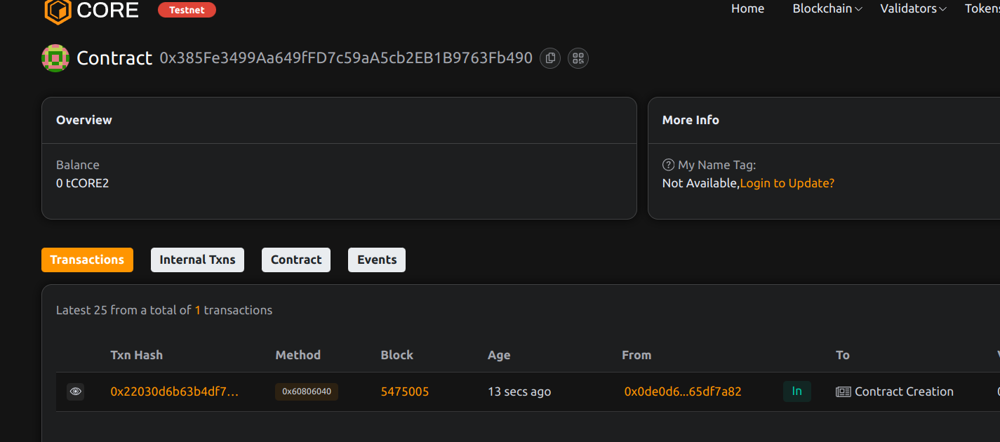

# ChainFundraise: Transparent Crowdfunding with Refund Guarantees

## Project Description
ChainFundraise is a trustless crowdfunding platform where backers are automatically refunded if projects fail to meet their funding goals. The system ensures complete transparency in fund collection and usage while protecting contributors' interests.

## Project Vision
To create the gold standard for decentralized fundraising by:
- Eliminating platform middlemen
- Guaranteeing backer protection
- Providing immutable funding records
- Enabling global access to capital

## Key Features
- Goal-based funding mechanism
- Automatic refund system
- Minimum contribution requirements
- Deadline enforcement
- Real-time funding tracking
- Creator verification

## Future Scope
- Milestone-based fund release
- Governance voting for projects
- Reputation scoring system
- Integration with payment processors
- Multi-token support

## Contract Details
0x385Fe3499Aa649fFD7c59aA5cb2EB1B9763Fb490
